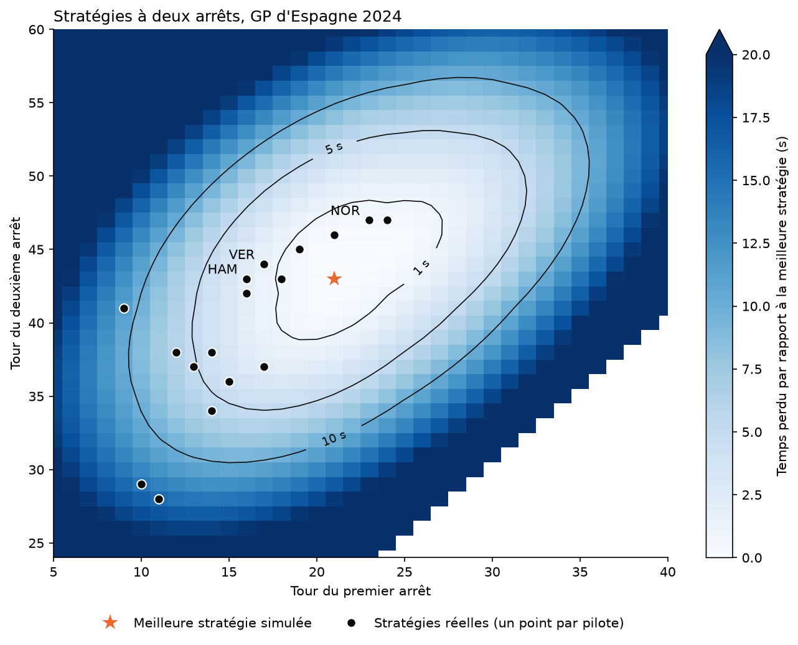
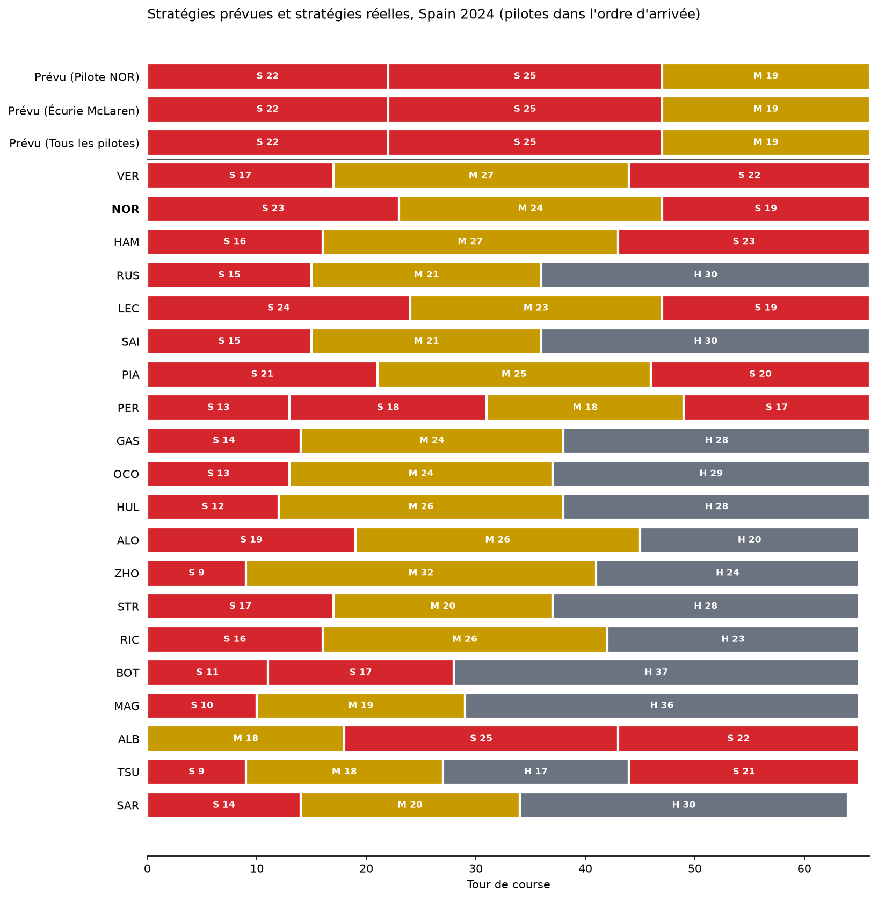

# F1 Race Strategy — Tyre Degradation Modelling & Pit Stop Simulator

**Work in progress.** The tyre model and the strategy search work end to end. The undercut simulation is not built yet, and the pre-race predictions are still rough (see [Known limitations](#known-limitations)).

## Overview

In a race, the strategy engineer constantly faces one question:
*"On which lap should the driver pit to minimise total race time, while limiting the risk of rejoining in traffic or under a neutralisation?"*

This project tackles that question with real data, in two ways:

- **After a race:** measure how fast each tyre compound wore out, then compute which pit stop laps would have been fastest and compare them with what the drivers did.
- **Before a race:** measure tyre wear in free practice, enter the tyre sets a driver has left, and get the fastest strategy achievable with those sets.

All data comes from official Formula 1 timing, through the open-source [FastF1](https://github.com/theOehrly/Fast-F1) library.

## Results so far

**Post-race analysis, 2024 Spanish Grand Prix** (`01_exploration.ipynb`):

- 1,310 race laps, of which 992 are kept after cleaning.
- Measured tyre wear: Soft 0.101 s per lap of tyre age, Medium 0.083, Hard 0.076.
- A pit stop costs 22.7 s.
- The fastest strategy is two stops, around laps 21 and 43. One stop is 9.6 s slower, three stops 5.2 s slower. Eighteen of the twenty drivers made two stops.
- Replaying the winner's real strategy in the simulator gives 1:28:20.3, against a real race time of 1:28:20.2.



**Pre-race prediction** (`02_prediction_essais.ipynb`): for Spain 2024, using practice data only, the tool recommends two stops on laps 22 and 47. Norris stopped on laps 23 and 47.



**Practice versus race** (`03_validation_essais_course.ipynb`): tyres wear less in the race than in practice. Over four circuits in 2023 and 2024, race wear was usually 35 % to 80 % of practice wear. The ratio is not stable enough to be predicted yet, so it is left as an adjustable input.

## Project structure

```
f1-strategy/
├── notebooks/
│   ├── 01_exploration.ipynb                # post-race analysis of one Grand Prix
│   ├── 02_prediction_essais.ipynb          # pre-race strategy tool (the "strategist interface")
│   └── 03_validation_essais_course.ipynb   # practice wear vs race wear, over several weekends
├── src/
│   ├── data_loader.py     # step 1: download laps and weather with FastF1
│   ├── cleaning.py        # step 2: keep only the laps that reflect real race pace
│   ├── degradation.py     # step 3: measure tyre wear per compound
│   └── strategy.py        # step 4: pit-stop cost and search for the best strategy
├── data/
│   ├── cache/             # FastF1 download cache (not versioned)
│   └── processed/         # reserved for cleaned datasets (empty for now)
├── figures/               # charts saved by the notebooks
├── requirements.txt
├── CLAUDE.md              # project notes for the AI assistant used during development
└── README.md
```

Code comments are written in French, names in English.

## What each file does

### Notebooks

**`notebooks/01_exploration.ipynb` — post-race analysis.**
Works on a race that has already been run (2024 Spanish Grand Prix by default). It is self-contained and does not use `src/`. In order, it:

1. loads the race laps and shows one driver's laps in a readable table;
2. corrects lap times for the fuel burnt during the race;
3. removes the laps that do not reflect normal pace (first lap, in-laps, out-laps, abnormally slow laps, laps in traffic);
4. measures tyre wear per compound and plots it;
5. fits a complete lap-time model: driver pace, compound, lap number and tyre age;
6. measures the time lost at the start and at a pit stop;
7. simulates every one-, two- and three-stop strategy and ranks them;
8. maps the two-stop strategies and compares them with the real ones.

**`notebooks/02_prediction_essais.ipynb` — pre-race strategy tool.**
Everything is entered in the first cell: Grand Prix, number of race laps, driver, team, the tyre sets available with their age, and the wear coefficient (race wear = coefficient × practice wear). The notebook then:

1. loads the three practice sessions and keeps the long runs;
2. measures tyre wear three times: with the driver's laps, with the team's laps, and with all drivers. When a driver has no long run on a compound, the team's value is used, then the field's;
3. measures the pit-stop cost and the maximum tyre age on the previous year's race at the same circuit;
4. shows the best strategy for each of the three data sets, with the best one-, two- and three-stop option;
5. repeats the search under different assumptions, to show how solid the answer is;
6. if the race has been run, shows every driver's real strategy under the predictions.

**`notebooks/03_validation_essais_course.ipynb` — practice versus race.**
Measures tyre wear in practice and in the race with the same method, for several Grands Prix and seasons, and compares the two. It also records track temperature for each session. This is the notebook that shows how far practice data can be trusted.

### Source code

**`src/data_loader.py`** — downloads data through FastF1 and stores it in `data/cache/`.
- `load_laps` returns the laps of one session.
- `load_track_temperature` returns the average track temperature of a session.
- `get_event_name` returns the official name of the Grand Prix that FastF1 matched to the text entered, to catch typing mistakes.

**`src/cleaning.py`** — selects the laps that can be used to measure tyre wear.
- `add_gap_ahead` computes the gap to the car that crossed the line just before.
- `select_long_run_laps` keeps timed laps under green flag, outside pit laps and traffic, at a steady pace, in stints of at least six laps.

**`src/degradation.py`** — measures tyre wear.
- `fit_wear` returns, for each compound, the time lost per lap of tyre age. Each stint gets its own pace level, so cars of different speeds can be compared.
- `select_wear` picks, for each compound, the most specific measurement available (driver, then team, then all drivers).

**`src/strategy.py`** — turns tyre wear into a strategy.
- `measure_pit_loss` measures the time lost on the in-lap and the out-lap of a pit stop.
- `measure_max_tyre_age` measures how old tyres got before teams changed them.
- `find_best_strategies` tests every strategy achievable with the available tyre sets and ranks them.
- `describe_stints` formats a strategy as readable text.

### Other folders

- **`data/cache/`** holds the FastF1 downloads. It is large and excluded from version control.
- **`data/processed/`** is reserved for cleaned datasets. Nothing is saved there yet.
- **`figures/`** holds the charts produced by the notebooks. File names include the Grand Prix and the year when they depend on them.

## Getting started

```bash
git clone https://github.com/cardsdeveloper/f1-strategy.git
cd f1-strategy
python -m venv .venv
source .venv/bin/activate      # Windows: .venv\Scripts\activate
pip install -r requirements.txt
```

Open a notebook in Jupyter or VS Code, select the `.venv` kernel, and run all cells. The first run downloads the data and takes a few minutes. Later runs read the cache.

To use the strategy tool, open `notebooks/02_prediction_essais.ipynb` and edit the first cell:

```python
YEAR = 2024
GRAND_PRIX = 'Spain'          # country or city, in English
RACE_LAPS = 66

DRIVER = 'NOR'                # three-letter code, or None
TEAM = 'McLaren'              # team name, or None

AVAILABLE_SETS = [('SOFT', 3), ('SOFT', 0), ('MEDIUM', 0), ('HARD', 0), ('HARD', 0)]   # (compound, laps already run)

RACE_WEAR_COEFFICIENT = 0.6   # race wear = coefficient × practice wear
```

After changing a file in `src/`, restart the notebook kernel so the change is picked up.

## Method in brief

- **Lap-time model.** Lap time = driver pace + compound offset + lap-number effect + wear × tyre age. Wear is linear in tyre age: on the 2024 Spanish Grand Prix, a quadratic or cubic fit did not describe the laps any better.
- **Fuel.** The car gets lighter and faster every lap. In the race this effect is measured (0.058 s per lap in Spain 2024). In practice it cannot be measured, so 0.05 s per lap is assumed.
- **Strategy search.** Every combination of pit stop laps and tyre sets is evaluated. Each tyre set is used once, at least two compounds are required, and a tyre cannot exceed a maximum age.
- **Maximum tyre age.** The data never shows a tyre collapsing, because teams change it before that happens. The limit is therefore taken from the previous year's race: the age that 90 % of stints did not exceed.

## Known limitations

- **Practice overestimates wear, by an amount that varies.** The wear coefficient ranged from 0.35 to 0.80 across the weekends tested, and two practice measurements were close to zero wear and unusable. Track temperature did not explain the differences.
- **The main race compound is often not run in practice.** Teams save their Hard sets for Sunday. The tool then borrows the wear of the nearest compound, which can be far off.
- **The pace gap between compounds is assumed, not measured** (Medium +0.3 s, Hard +0.6 s per lap against a new Soft). The recommended compounds depend on it.
- **Compound choice is the weakest part.** For Hungary 2024 the tool recommended Soft–Soft–Medium, while 14 of the 20 drivers ran only Medium and Hard.
- **The order of the stints is not modelled.** Soft–Medium–Soft and Soft–Soft–Medium give the same time.
- **Each car races alone.** Traffic, undercuts and Safety Cars are not simulated, which is why most drivers stop earlier than the computed optimum.
- **One driver's practice data is very noisy.** It usually rests on one or two stints.
- **A circuit that changes between two seasons** (resurfacing, a race neutralised the year before) makes the previous year's race a poor reference.

## Roadmap

- [x] Data extraction from a Grand Prix
- [x] Data cleaning (in-laps and out-laps, slow laps, traffic)
- [x] Tyre degradation model per compound, with fuel correction
- [x] Strategy simulator: one, two or three stops, with limited tyre sets
- [x] Pre-race prediction from free practice
- [ ] Better practice-to-race wear correction, tested on more Grands Prix
- [ ] Measured pace gap between compounds, and stint order
- [ ] Driving in traffic and undercut success probability (Monte Carlo)
- [ ] Safety Car scenarios

## Tech stack

Python · FastF1 · pandas · NumPy · Matplotlib · Jupyter

## Data source

Official Formula 1 timing data accessed through the open-source FastF1 library. This project is unofficial and not associated with Formula 1 or the FIA.
